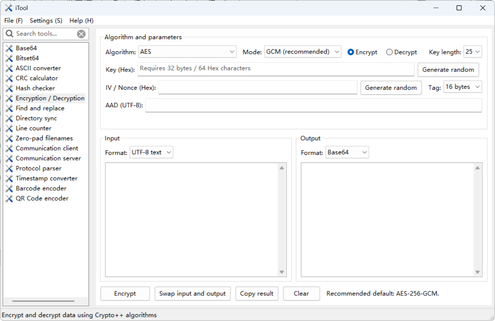
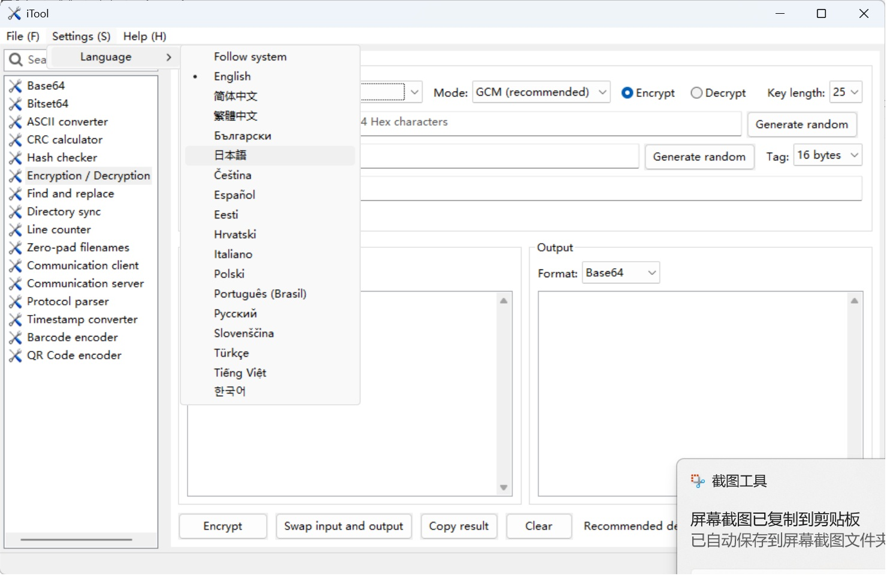

# iTool

[简体中文](README-CN.md) | English






A cross-platform multi-tool application built with wxWidgets. The current Windows build uses the following defaults:

- `D:\tools\w64devkit` (x86 / i686)
- wxWidgets 3.2.11 and Crypto++ 8.9 source archives in `src\third_party\distfiles`
- Windows XP SP3 as the minimum supported runtime
- Automatic `strip --strip-all` and `upx --best --lzma` execution for Release builds

## Versioning

During configuration, CMake automatically runs `git describe --tags --always --dirty=-dirty`
and generates `build/<platform>/generated/version.h`. There is no need to edit a source
header manually. For example:

```text
v1.2.0                   Exactly at the v1.2.0 tag
v1.2.0-3-ga3f5c2d         Three commits after the tag
v1.2.0-3-ga3f5c2d-dirty   The working tree contains uncommitted changes
```

The version appears in **Help → About**, is written to Windows EXE and macOS bundle
metadata, and is included in artifact filenames, such as `iTool-v1.2.0-3-ga3f5c2d.exe`.
Create a Git tag such as `v1.2.0` for a release. Without a version tag, the short commit
hash is displayed, and numeric platform metadata falls back to the version in
`project(iTool VERSION ...)`. Source copies without `.git` metadata also fall back to
that version, so an `iTool-unknown` artifact is never generated.

Release builds automatically strip the final executable: Windows and Linux use
`strip --strip-all`, while macOS uses `strip -x` for Apple Mach-O binaries.

QR code encoding uses Project Nayuki's QR Code generator (MIT License). The license
text is retained in `src/third_party/qrcodegen/qrcodegen.hpp` and `qrcodegen.cpp`.

## Building on Windows

Double-click `build-windows-x86.cmd` in File Explorer, or run it from the command line:

```bat
build-windows-x86.cmd
```

The script validates the source archives, automatically builds both static libraries,
caches them in `build\dependencies\windows-x86\install`, and then compiles iTool.
The source archives are shared with Linux/macOS and excluded by `.gitignore`.

You can override the wxWidgets and Crypto++ installation directories when building:

```bat
build-windows-x86.cmd -DITOOL_WX_ROOT=D:\path\to\wxWidgets-install -DITOOL_CRYPTOPP_ROOT=D:\path\to\cryptopp-install
```

Either parameter can be set independently. When omitted, the default directory above
is used. The Crypto++ directory should contain `include\cryptlib.h` and
`lib\libcryptopp.a` (or the equivalent static library filename for the platform).

Output:

```text
build\windows-x86-release\bin\iTool-<git-describe>.exe
```

The application icon source is `resources/icons/itool-source.png`, and the Windows
multi-size icon is `resources/windows/itool.ico`. Windows MinGW Release builds always
run `strip`, followed by UPX compression of the executable.

You can also build manually:

```bat
set PATH=D:\tools\w64devkit\bin;%PATH%
cmake --preset windows-xp-x86-release
cmake --build --preset windows-xp-x86-release
```

## Building on Linux

You need a C++ compiler, CMake, Ninja, and the system development dependencies for wxGTK.
System-installed versions of wxWidgets and Crypto++ are no longer used: the build script
automatically builds both libraries from local source archives and links them statically.
`libgcc`, `libstdc++`, glibc, GTK, X11/Wayland, and system libraries remain dynamically
linked. wxGTK creates and exits threads across shared-library boundaries. Statically
linked GNU runtimes would coexist with the `libgcc_s.so.1` loaded by GTK, creating two
exception-unwinding runtimes and causing a crash in `_Unwind_ForcedUnwind` when a thread exits.
The TIFF, JPEG, PNG, zlib, and Expat libraries bundled with wxWidgets are linked statically
to avoid carrying version-specific dependencies such as the build system's `libtiff.so.5`
onto newer distributions.

On Ubuntu/Debian, install:

```sh
sudo apt update
sudo apt install build-essential cmake ninja-build libgtk-3-dev \
  libgl1-mesa-dev libglu1-mesa-dev libexpat1-dev libcurl4-openssl-dev
```

Before building, place these two files in `src/third_party/distfiles/`.
The archives are excluded by `.gitignore` and should not be committed:

```text
wxWidgets-3.2.11.zip
cryptopp890.zip
```

Then run:

```sh
sh build-linux.sh
```

The minimum glibc version required by a release is determined by **the build machine's
glibc** and cannot be lowered with a CMake option. Build in a container or virtual
machine running the oldest distribution you intend to support. For example, a build
based on Ubuntu 20.04 requires glibc 2.31 or later. Supporting older systems requires
an appropriately older build image. Do not add `-static` to a desktop application to
link glibc statically: runtime features such as NSS, DNS, locales, and GTK plugins still
depend on dynamic system components.

Before releasing, inspect dependencies and the actual symbol versions:

```sh
artifact_name=$(cat build/linux-release/generated/artifact-name.txt)
ldd "build/linux-release/bin/$artifact_name"
objdump -T "build/linux-release/bin/$artifact_name" | \
  grep -o 'GLIBC_[0-9.]*' | sort -Vu | tail -1
```

The first run verifies the archives' SHA256 checksums, extracts them, and builds the
dependencies. Later runs reuse the results in `build/dependencies/` as long as the
versions, platform, architecture, and source archives have not changed. Set
`ITOOL_BUILD_JOBS` to control the number of parallel jobs.
After building the main application, the script also checks its final dynamic
dependencies. The build fails if it still links to shared wxWidgets or Crypto++
libraries, or directly depends on a dynamic libtiff library.

Once the dependencies have been built, the equivalent manual commands for the main
project are:

```sh
deps_prefix="$PWD/build/dependencies/linux-$(uname -m)/install"
cmake -S . -B build/linux-release -G Ninja -DCMAKE_BUILD_TYPE=Release \
  -DITOOL_STATIC_THIRD_PARTY=ON \
  -DwxWidgets_CONFIG_EXECUTABLE="$deps_prefix/bin/wx-config" \
  -DITOOL_CRYPTOPP_ROOT="$deps_prefix"
cmake --build build/linux-release
ctest --test-dir build/linux-release --output-on-failure
```

The generated ELF binary is `build/linux-release/bin/iTool-<git-describe>`.
The double-clickable launcher with the application icon is
`build/linux-release/bin/iTool.desktop`. A bare Linux ELF binary cannot embed a
file-manager icon. The adjacent `itool.png` is used only for the application window
and does not change the ELF file's icon.
Linux Release artifacts use the traditional `ET_EXEC` format to prevent Ubuntu
file managers from misidentifying default PIE binaries as "shared libraries".
Command-line execution and launching through the `.desktop` file are unaffected.

Some file managers require you to right-click the `.desktop` file and choose
**Allow Launching** or **Trust and Launch** the first time you use it.
Installing the application places the launcher and icon in the standard application
menu locations:

```sh
sudo cmake --install build/linux-release --prefix /usr/local
```

## Building on macOS

Install Xcode Command Line Tools, CMake, and Ninja first. As on Linux, the script
automatically builds static wxWidgets and Crypto++ libraries from the fixed-version
source archives in `src/third_party/distfiles/`.

```sh
xcode-select --install
brew install cmake ninja
```

Then run:

```sh
sh build-macos.sh
```

The script defaults to `CMAKE_OSX_DEPLOYMENT_TARGET=11.0`. You can override the minimum
system version, for example:

```sh
MACOSX_DEPLOYMENT_TARGET=12.0 sh build-macos.sh
```

The deployment target must be no lower than the versions actually supported by the
Xcode SDK and all static dependencies in use. macOS platform libraries such as Cocoa,
System, and libSystem remain dynamically linked; this is normal and necessary.

Once the dependencies have been built, the equivalent manual commands for the main
project are:

```sh
deps_prefix="$PWD/build/dependencies/macos-$(uname -m)/install"
cmake -S . -B build/macos-release -G Ninja -DCMAKE_BUILD_TYPE=Release \
  -DITOOL_STATIC_THIRD_PARTY=ON -DCMAKE_OSX_DEPLOYMENT_TARGET=11.0 \
  -DwxWidgets_CONFIG_EXECUTABLE="$deps_prefix/bin/wx-config" \
  -DITOOL_CRYPTOPP_ROOT="$deps_prefix"
cmake --build build/macos-release
ctest --test-dir build/macos-release --output-on-failure
```

The output is `build/macos-release/bin/iTool-<git-describe>.app`.
Both Apple Silicon and Intel Macs default to the host machine's architecture.
To specify an architecture, append `-DCMAKE_OSX_ARCHITECTURES=arm64` or
`-DCMAKE_OSX_ARCHITECTURES=x86_64` to the configuration command.

To force a rebuild of both third-party libraries, delete the cache directory for the
corresponding platform and rerun the script:

```sh
rm -rf build/dependencies/linux-$(uname -m)   # Linux
rm -rf build/dependencies/macos-$(uname -m)   # macOS
```

The communication client and server on Windows, Linux, and macOS support TCP, UDP,
WebSocket (RFC 6455, using Text frames for ASCII and Binary frames for Hex, with
fragmentation and Ping/Pong support), and serial ports. WebSocket currently supports
unencrypted `ws://` connections with a configurable request path; TLS `wss://` is not
yet available. Serial baud-rate presets go up to 921600, and manual values from
1 to 4000000 are accepted. Linux uses `termios2/BOTHER`, and macOS uses `IOSSIOSPEED`
to configure nonstandard baud rates. The current user must have permission to access
the serial device.

The MQTT client is compatible with MQTT 3.1.1 brokers. It connects with Clean Session
and QoS 0, subscribes to a response topic, and publishes each test frame to a request
topic. The MQTT server is a lightweight, single-connection test endpoint that handles
CONNECT, SUBSCRIBE, PUBLISH, PINGREQ, and DISCONNECT, and publishes responses based on
payload mappings. It is not a general-purpose MQTT broker.
MQTT TLS, username/password authentication, QoS 1/2, retained messages, and persistent
sessions are currently unsupported.

On Linux and macOS, user data is stored in `~/.iTool/`: configuration is saved in
`~/.iTool/iTool.ini`, and communication logs are stored in `~/.iTool/logs/`.
On Windows, `iTool.ini` and `logs/` remain in the executable's directory.

## Localization

iTool uses wxWidgets gettext catalogs. English, Simplified Chinese, and Traditional
Chinese are currently available. On first launch, the application follows the system
language; upgrades from older versions retain Simplified Chinese. Change the language
under **Settings → Language**, then restart the application for it to take effect.

Translation source files use a flat directory layout: `locale/iTool.pot` and
`locale/<language-code>.po`. The available catalogs cover English, Bulgarian, Japanese,
Czech, Spanish, Estonian, Croatian, Italian, Polish, Brazilian Portuguese, Russian,
Slovenian, Turkish, Vietnamese, Korean, Simplified Chinese, and Traditional Chinese.
CMake automatically generates the runtime directory structure required by gettext
and the `iTool.mo` files. You can also compile an individual catalog manually:

```powershell
python tools/compile_mo.py locale/zh_CN.po build/locale/zh_CN/LC_MESSAGES/iTool.mo
```

After adding or removing `ITOOL_TR` strings, run `python tools/update_translations.py`
to update the template and the three language catalogs. The language menu is generated
from the `SupportedLanguages()` list, so its entries do not need to be maintained
separately in the UI code. `python tools/check_translations.py` checks for missing
and extra strings, as well as format placeholders such as `%s` and `%u`.
CI also runs this check through CTest.

Use English source strings wrapped in `ITOOL_TR("Message")` for new UI text, and
provide translations in each PO file. Do not translate protocol names, algorithm names,
configuration keys, or tool IDs. Save dropdown state using indices or stable values,
rather than translated display text.

## Module Development

`src/core/IToolModule.h` defines the tool module contract. When adding a tool, place
its UI and platform-independent logic in `src/tools`, and the necessary tests in `tests`.

The **Encrypt/Decrypt** tool uses Crypto++ and supports AES, SM4, DES, 3DES, and RSA.
Symmetric algorithms offer applicable modes such as GCM, CBC, CTR, and ECB.
RSA offers OAEP-SHA256, OAEP-SHA1, and PKCS#1 v1.5. Input and output formats can be
selected independently from UTF-8, Hex, Base64, or files. DES, 3DES, ECB, and PKCS#1 v1.5
are labeled for compatibility use in the UI. CBC/ECB support PKCS, Zero,
ISO/IEC 7816-4, or No Padding. AES-256-GCM is the recommended default for new data.

The encryption tool supports AES, SM4, DES/3DES, Blowfish, Twofish, CAST5, IDEA, Serpent,
TEA/XTEA/XXTEA, RC4/5/6, ChaCha20, Salsa20, Camellia, SEED, and RSA.
Crypto++ 8.9 does not provide SM2, and no unverified custom cryptographic implementation
is used as a substitute.

The CRC tool accepts Hex, UTF-8 text, and file input. It can calculate 18 preset
algorithms simultaneously and provides a custom row with editable Width, Init, Poly,
XorOut, RefIn, and RefOut values. File mode uses `CreateFileMapping/MapViewOfFile`
on Windows and `mmap` on GTK/macOS, processing the file in 64 MiB views so that
32-bit processes do not need to load an entire large file into memory.

To add a tool:

1. Create a `src/tools/toolXX` directory.
2. Extract UI-independent logic into a Service/Model.
3. Implement the UI using `wxPanel`.
4. Implement `IToolModule` and replace the corresponding placeholder in `MainFrame::RegisterTools()`.
5. Add the new source files to `CMakeLists.txt`.

Do not use MFC types or `HWND` in the business layer, or make it directly dependent
on Windows controls.

## Windows XP Release Validation

- Test on a clean Windows XP SP3 virtual machine or physical machine.
- The target CPU must support SSE2.
- Inspect the EXE import table to ensure that it does not reference system APIs unavailable on XP.
- Verify that the release directory does not depend on `libgcc`, `libstdc++`, `libwinpthread`, or wxWidgets DLLs.
- Validate XP compatibility separately for every newly added third-party library.
